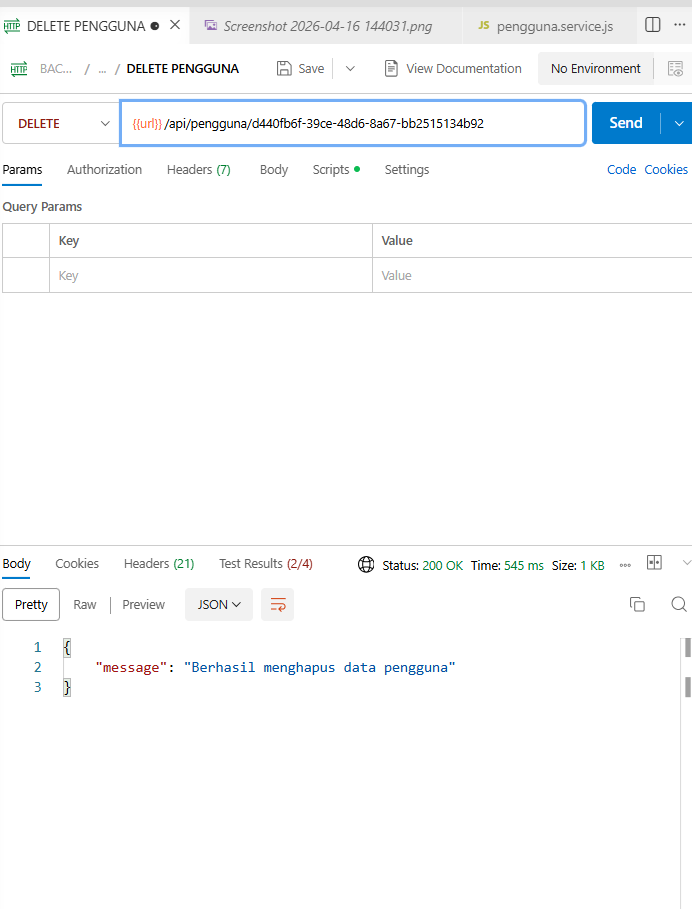
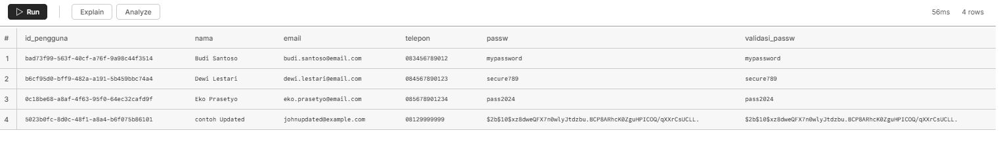

# 📋 Testing API Pengguna

## 📑 Daftar Isi
- [Setup Database](#setup-database)
- [Setup Environment](#setup-environment)
- [Jalankan Server](#jalankan-server)
- [Testing dengan Postman](#testing-dengan-postman)
- [Validasi Schema](#validasi-schema)
- [Error Handling](#error-handling)

---

## 🗄️ Setup Database

1. Buat database PostgreSQL di neon
2. Jalankan script SQL untuk membuat tabel
3. Insert data dummy (opsional)

---

## ⚙️ Setup Environment

1. npm install env / langsung buat file dengan isi jsonnya env dalam devdependencies `"dotenv": "^17.3.1"`
2. Isi konfigurasi database di `.env`:

```env
PG_URL=
PORT=
```

---

## 🚀 Jalankan Server

```bash
npm install
npm start
```

Server akan berjalan di `http://localhost:3000`

---

## 🧪 Testing dengan Postman

1. Import file `BACKEND CAMP4.postman_collection.json` ke Postman
2. Pastikan variable `url` sudah diset ke `http://localhost:3000`
3. Jalankan request sesuai urutan berikut:

### ✅ 1. CREATE NEW PENGGUNA (POST)

**Endpoint:** `POST /pengguna`

**Request Body:**
```json
{
  "nama": "John Doe Test",
  "email": "johndoe@example.com",
  "telepon": "08123456789",
  "passw": "password123",
  "validasi_passw": "password123"
}
```

**Expected Response (201):**
```json
{
  "message": "Berhasil membuat data pengguna baru",
  "data": {
    "id_pengguna": "uuid-generated",
    "nama": "John Doe Test",
    "email": "johndoe@example.com",
    "telepon": "08123456789",
    "passw": "password123",
    "validasi_passw": "password123"
  }
}
```

**Contoh Hasil:**


Baris db sudah ditambahkan:


> ℹ️ Password john doe berbeda karena saya menambahkan hash password dari pustaka bcrypt

---

### ✅ 2. GET PENGGUNA (GET) - Limit Data 5 Baris

**Endpoint:** `GET /pengguna?page=1&limit=5`

**Expected Response (200):**
```json
{
  "message": "Berhasil mengambil data pengguna",
  "page": 1,
  "limit": 5,
  "data": [...]
}
```

**Contoh Hasil:**


---

### ✅ 2.1 GET PENGGUNA (SEMUA PENGGUNA)

**Endpoint:** `GET /pengguna/semuaPengguna`

**Expected Response:**
```json
{
  "message": "Berhasil mengambil semua data pengguna",
  "data": [...]
}
```

**Contoh Hasil:**


---

### ✅ 3. UPDATE PENGGUNA (PUT)

**Endpoint:** `PUT /pengguna/:id_pengguna`

**Request Body:**
```json
{
  "nama": "John Doe Updated",
  "email": "johnupdated@example.com",
  "telepon": "08129999999",
  "passw": "newpass123",
  "validasi_passw": "newpass123"
}
```

**Expected Response (200):**
```json
{
  "message": "Berhasil memperbarui data pengguna",
  "data": {...}
}
```

**Contoh Hasil:**


**Hasil Database:**


---

### ✅ 4. DELETE PENGGUNA (DELETE)

**Endpoint:** `DELETE /pengguna/:id_pengguna`

**Expected Response (200):**
```json
{
  "message": "Berhasil menghapus data pengguna"
}
```

**Contoh Hasil:**



**Hasil Database:**




> ℹ️ Menghapus db row ke 4 'john doe test'

---

## ✔️ Validasi Schema

Schema validasi menggunakan **Zod**:

Schema validasi menggunakan **Zod**:

#### 📝 Skema Membuat Pengguna (`tambahPenggunaSchema`)
- `id`: menggunakan pustaka uuid
- `nama`: minimal 5 karakter
- `email`: format email valid
- `telepon`: minimal 10 karakter
- `passw`: minimal 6 karakter
- `validasi_passw`: minimal 6 karakter dan harus sama dengan `passw`

#### 📝 Skema Perbarui Pengguna (`perbaruiPenggunaSchema`)
- `nama`: minimal 5 karakter
- `email`: format email valid
- `telepon`: minimal 10 karakter
- `passw`: minimal 6 karakter
- `validasi_passw`: minimal 6 karakter dan harus sama dengan `passw`

---

## ⚠️ Error Handling

| Kode | Keterangan |
|------|-----------|
| 400 | Validasi gagal (ZodError) |
| 404 | Data tidak ditemukan |
| 500 | Server error |

---

**Made with ❤️**
